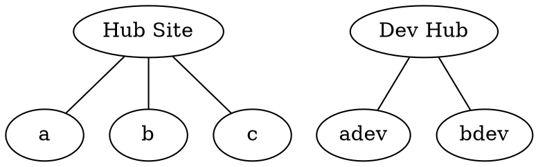

Microsoft SharePoint is a vast product. It started life as a document
repository, added website authoring functionality, and now it also offers a
full client-side application platform, as well as a vast selection of plugins.
In addition, it’s connected up with many of Microsoft’s other cloud
applications such as OneNote, Teams, and Office.

18F is working more with SharePoint in partner engagements with agencies who
already have Microsoft subscriptions. This document presents some introductory
concepts and thoughts for using SharePoint as a platform for modern software
engineering. These notes were initially prepared as part of an engagement with
DOE’s Nuclear Smuggling Detection and Deterrence (NSDD) office but any
DOE-specific content has been removed.

## SharePoint Presentation Methods

It’s important to understand the various options for how to put content onto a
SharePoint site so that we can make good decisions as we build out our sites.

Content in SharePoint is displayed on pages. There is a page editor where the
page is constructed from individual web parts in SharePoint terminology. There
are web parts provided by Microsoft for things like News, Call to Action,
Images, Document Library, as well as basic items like images and text boxes.

There are a number of web parts that we could use  and we give examples here
and look at the pros and cons of each one.

### Text blocks


We can build a SharePoint site as a traditional website where content is
written in blocks of text and links are created in that text as ordinary HTML
links. The advantage of this is that it is highly accessible to non-technical
editors. Many people are available to manage content created this way. The
disadvantage is that it is highly manual. Each link must be created manually
by an editor and when the location of a linked document changes, the link
needs to be updated individually.

### SharePoint Lists


SharePoint has a built-in data format called a List. The list is a standard
column-oriented data type similar to what would be seen in a spreadsheet. A
list is a single item in SharePoint and that list can then be displayed on a
page or pages by using a list view web part. An advantage of this approach is
that the data is available in a structured format and can be accessed and
modified using Microsoft APIs from custom code. Also, the same data can be
repeated on multiple pages by referring to the same list. The disadvantage is
that there is limited expressiveness for a single list with multiple columns
and interaction with other tools such as Excel spreadsheets is possible but
not at all easy to set up.

### Document Embedding


Microsoft Office documents from the SharePoint document library can be
embedded on SharePoint pages using a File View web part. There is some
interactivity possible (for example, an Excel file can be sorted by different
columns) and there is easy access to open the file in Word/Excel/etc. for a
richer editing experience. There is limited control over the display of the
data on SharePoint because it replicates the appearance in the Office
document. An advantage of this option is that it uses familiar tools like Word
and Excel for content creation and maintenance. The disadvantage is in limited
control of the appearance of the content and often the SharePoint page needs
to be re-loaded to see the latest content from when changing the Office 365
document.

### Client-side Web Parts (SharePointFramework)


One of Microsoft’s newest offerings, SharePointFramework is a complete
application platform that is available hosted by SharePoint. Using the
client-side Javascript environment of the web browser, this allows rich
applications to be developed using frameworks like React. These applications
are developed as code that can be version-controlled in a github repository
and can then be published into the SharePoint tenant. All interaction with the
Microsoft ecosystem is through APIs with the client-side web app asking for
permissions to access various parts of the SharePoint and Microsoft 365
environment. The advantage of this option is that it offers a modern
development environment with version-controlled source code, automated
testing, and continuous integration. It also offers the complete range of
visual presentation options as it can include anything that can be created
using Javascript/HTML/CSS. The major disadvantage is that it requires
developers skilled in those technologies.

### Power Apps


Microsoft’s PowerApps is an application development framework that is
"low-code/no-code", where a web and mobile friendly application can be
developed without complicated software frameworks. The capability is somewhat
limited, but there are basic UI elements as well as connections with data
sources such as SharePoint Lists and various databases. Power Apps can be
embedded on SharePoint pages using a Power Apps web part, so a power app can
serve as a tool for displaying and interacting with content in a SharePoint
site. The advantages are that we can develop interactive experiences with data
stored in other systems and the interaction can happen directly on the
SharePoint page. Also, Power Apps may be simple enough to make their
development open to a larger group of people. However, there is still a
learning curve to making complicated applications and complete code-level
flexibility isn’t available.

### Power BI


Power BI is a Microsoft tool for visualizing data. It can connect to many
different data sources including databases and files in Office 365. It offers
the ability to make charts, graphs, and maps from the data that it is
connected to and there is a SharePoint web part for displaying those
visualizations on a SharePoint page. If data is available in structured
formats inside of the Microsoft ecosystem, then Power BI could give valuable
insights into that data. The advantage is that it gives us access to richer
visual displays than a text box or list and the visualizations can be
connected to other live data sources. The disadvantage is that Power BI is
another complicated tool for developers to learn and it requires that the
source data be available in a structured format that Power BI can access.

### Power Flow

Another one of Microsoft’s "Power" tools, Power Flow is not a display tool,
but it is a workflow automation system. If we need notifications or messages
to be sent out when certain things happen on SharePoint or with various
documents, then we can configure a Flow to do those actions. This may not be a
large part of a SharePoint site, but it could be an important capability if
needed.

## SharePoint Development Process

Development of software projects needs to follow certain principles in order
to be efficiently managed. All software changes should be _tracked_, _reviewed_,
and _incremental_ (or _reversible_). Version-controlled source code with code
reviews is the current gold standard for software engineering, but it isn’t
available for all software platforms. In particular, a content management
system like SharePoint is configured through a web interface rather than via
source code, so we can’t use version control and the related tools for
tracking and reviewing changes directly.

Instead, we will need to use a development process that enforces the
principles of tracking, reviewing, and reversibility by convention rather than
by design.

### Architecture

SharePoint Online provides only a single tenant for each subscription. A
tenant is the highest level of organization and corresponds to what used to be
a SharePoint server farm in older on-premises versions of SharePoint. While
there is a possibility to make a completely separate development tenant under
a second Microsoft subscription, this may be cost-prohibitive or
infrastructurally infeasible.

Within each SharePoint Online tenant, the next level of organization in
SharePoint is a hub site (see Microsoft’s
[documentation](https://docs.microsoft.com/en-us/sharepoint/planning-hub-sites)).
This is a _site_ in SharePoint’s terminology to which other sites can be linked
to give common navigation and search to each of the linked sites. Each
individual site can be either a "team site" or "communication site". A team
site has permissions linked by default to a user group from Microsoft Teams. A
communication site has permissions that are managed from within SharePoint
itself. All types of sites can host the same pages and page elements, so the
distinctions are mainly around how permissions are managed.

#### Development Architecture

In order to separate development work from active production sites, we need to
create separate hub sites and team sites for development purposes. New
features, pages, and configurations will be developed in these dev sites and
when they are ready, they are moved into the production sites. This lets
developers make changes more freely without having to worry that what they do
will affect people who are actually using the production sites.


<details>
<summary>Source for diagram</summary><br/>

This diagram was created with [Graphviz](https://graphviz.org/), and the
source is below for future edits. Use an online editor, such as
[Edotor](https://edotor.net/), and download the resulting graph SVG to update
the image. Don’t forget to copy-paste the source back into this page for next
time an edit is needed!


</details><br/>

The development sites only need to reproduce whatever production functionality
is needed to make sure that they work correctly, so they don’t need a
development version of every single team or communication site.

### Workflow

As mentioned above, the principles of effective software engineering need to
be enforced here by convention. We describe here a series of stages for each
piece of work to help follow these conventions and principles.


<details>
<summary>Source for diagram</summary><br/>

This diagram was created with [Graphviz](https://graphviz.org/), and the
source is below for future edits. Use an online editor, such as
[Edotor](https://edotor.net/), and download the resulting graph SVG to update
the image. Don’t forget to copy-paste the source back into this page for next
time an edit is needed!


</details><br/>

#### 1. Development

This is the stage where a developer is making changes only in the development
sites to accomplish a particular goal. Because there isn’t source code
available as a reference to what has been changed, developers need to take
particular care to document the changes that they have made so that the same
changes can be made in production.

#### 2. Pull Request

In traditional version control, a change is proposed via a "Pull Request".
This describes a single change or feature and proposes it for inclusion into
the production code. That proposal starts the process of testing and review
and helps to track the status of the change. In the absence of version
control, a pull request should have enough details that another person could
make the same change that the developer made.

#### 3. Review/Testing

After a change is proposed via a pull request, someone other than the original
developer needs to review the change and test that it works correctly. In the
case of SharePoint, this could include reading the description of the change
in the pull request to make sure that it seems correct, then testing in the
development sites to see that it performs as described for the feature. The
reviewer then approves the pull request.

#### 4. Deployment

Once a pull request is approved, it needs to be deployed to the production
site. It may be easiest for the original developer to do this, but it isn’t
required. It is important that the change that is deployed is the change that
was reviewed in the pull request. It can be tempting to deploy additional
"improvements" that have been made since the time of the pull request, but if
deployed, those changes will have escaped the code review process.

#### 5. Testing

The final stage is testing that the deployed changes in production meet the
requirements of the particular feature. If the testing in stage 3 is thorough
and the deployment process is predictable, then this testing process may be
simple and straightforward, but in cases where the production site is
different from the development sites, there can be substantial work involved
in making sure that the changes work as intended in production.

## SharePoint and Microsoft Teams

There are lots of connections between Microsoft Teams and SharePoint sites.
This section is just a collection of notes on those connections.

### Every team gets a site

Creating a Microsoft Team creates a corresponding SharePoint site. That
SharePoint site provides the home for documents that the team is collaborating
on. The SharePoint site has a document library (called "Shared Documents") and
every channel that is created in Microsoft Teams gets a folder named after the
channel inside the document library. This connection means that any file that
is shared or linked in a Teams message gets stored in the channel’s folder in
SharePoint. If there are lots of screenshots or other files being attached in
the channel’s discussion, this can make that SharePoint folder unorganized.

If you use the SharePoint site and document library corresponding to a
Microsoft Team, don’t rely on the folders associated with channels to stay
organized. Use sub-folders like "General\Budget Files" inside the "General"
channel’s folder, or create separate folders in the document library such as
"Budget Files".

### Team sites set default sharing policies

In SharePoint sites associated with Microsoft teams, files are shared by
default with all of the people who are in the corresponding team. The
individual files in the document library can each have their sharing
permissions changed, but when they are created or uploaded, the default is
that members of the team will be able to edit the file. This default sharing
policy is one of the main ways that a SharePoint "team site" is different from
other SharePoint sites.

### Team sites have a default home page

A SharePoint site associated with a Microsoft team is a fully functional
SharePoint site. It can host all of the different types of SharePoint pages
and web parts that are available in other SharePoint sites. The distinctive
appearance of the team site comes from a default home page that has links to
"Conversations" and "Notebook" in the left-hand navigation and web parts for
"News", "Activity", and "Documents". If the default permissions associated
with a team site’s document library are desired, then the web portion of the
site can be designed for any purpose.

### Private channels create their own SharePoint site

Microsoft Teams allows people to create channels that are private, where a
specified group of team members can see the contents of the channel. There is
a question on how the files shared in that channel will appear in the
SharePoint document library for the entire team. Will files shared in the
private channel inherit the default sharing permissions for the entire team?
No, they don’t because (perhaps surprisingly) Microsoft creates a whole new
SharePoint team site for each private channel. The document library in that
team site is used for files shared in the private channel so those files are
completely separate from those of the containing team and the folders
containing files from the other public channels.

There is also a corresponding Microsoft 365 security group that can be
observed in the sharing settings for documents in the private channel.
However, both the security group and the SharePoint site itself don’t appear
in the admin interface for Microsoft 365 groups or SharePoint sites, even
though there is clearly an entire SharePoint site appearing at
`whatever.sharepoint.com/sites/TeamName-privatechannel`. It appears that the
only way to administrate the implied site and security group is within
Microsoft Teams.

### Hub sites cannot be nested

A SharePoint site can be designated as a "hub site" by a SharePoint
administrator. Microsoft recommends that you use a "communications site" as a
hub site, but any site can be designated as a hub site. (Besides the default
permissions and home page, there is little difference between team sites and
communications sites.) Hub sites can’t be nested multiple levels, so a site
that is already associated with a hub site cannot itself be registered as a
hub site.

A hub site provides unified search of all the sites associated with it, as
well as a consistent top navigation menu for each of the sites associated with
it. The hub site can also be used to host content as with any other SharePoint
site, but the top navigation menu and search capabilities are what will be
inherited by the sites associated with it. Microsoft doesn’t allow multiple
levels of nesting of hub sites and this means that a sequence of hub sites
can’t be used to provide a sophisticated information architecture for a very
large content site.

### Files can be moved between sites (but not easily)

Files in SharePoint can be moved between document libraries, but the ability
to do so can be hard to find in the UI and hard to specify the destination
site and document library. There are `Move-PnPFile` and `Copy-PnPFile`
commands in the SharePoint PowerShell module that might help. There is also
move/copy functionality within the Microsoft Teams client, but it can only be
used between the document libraries associated with teams rather than those in
other SharePoint sites. Also note that copying files into a team’s document
library will apply the default permissions of that team site, so everyone on
the team will be able to view and edit the new copy of the file.

## PowerShell for SharePoint administration

Microsoft’s PowerShell is a command-line shell for Windows that can be
extended with modules. One of the modules that Microsoft makes available is
for SharePoint administration. There are things that are possible with the
PowerShell module that are either impossible or much harder in the SharePoint
web interface. One difficulty to overcome is that the PowerShell version
available in legacy environments (Windows 7) does not make it easy to install
the SharePoint PowerShell module.

This document explains some possible ways that the SharePoint PowerShell
module can be useful and how to install the SharePoint PowerShell module under
Windows 7.

### SharePoint PowerShell Uses

Documentation for all of the SharePoint PowerShell commands is at
<https://docs.microsoft.com/en-us/powershell/module/sharepoint-pnp>. We describe
a small selection of some useful commands here.

#### Create a SharePoint site

Using PowerShell it is possible to create new SharePoint sites even when the
ability to create new sites is turned off in the web interface. Here’s an
example:

```powershell
Connect-PnPOnline https://tenant.sharepoint.com -UseWebLogin
```

That connects our PowerShell session to the SharePoint tenant.

```powershell
New-PnPSite -Type CommunicationSite -Title 'TEST' -Url https://tenant.sharepoint.com/sites/TEST -Owner your_email@example.gov
```

Which creates a new communication site on the SharePoint tenant. It may not be
widely known that it is possible to create new SharePoint sites this way when
site creation is disabled in the Web UI, so this technique should be used
judiciously. The created site is also not accessible by anyone, so the
permissions need to be set as desired.

#### Set permissions

There is a command to set user permissions on our new site.

```powershell
Connect-PnPOnline https://tenant.sharepoint.com/sites/TEST
Set-PnPWebPermission -User your_email@example.gov -AddRole 'Full Control'
```

The possible roles that can be added are available with the command
`Get-PnPRoleDefinition`.

#### Create a SharePoint page

It is possible to create new pages on the site programmatically from PowerShell.

```powershell
Add-PnPClientSidePage -Name "Folder/PageOne"
```

would make an empty page on the SharePoint site at `tenant.sharepoint.com/sites/TEST/SitePages/Folder/PageOne.aspx`.

### Installing the SharePoint PowerShell module

Some legacy environments such as Windows 7 may only offer PowerShell 4 which
doesn’t include the PowerShell package management infrastructure. We are going
to install that infrastructure in our personal PowerShell path and then use it
to install the SharePoint PowerShell module.

#### 1. Install PowerShellGet

Go to <https://www.powershellgallery.com/packages/PowerShellGet/2.2.1> and
select "Manual Download" and then click on the "Download the raw nupkg file".
You need to unzip that file, so in Windows Explorer, go to your "Downloads"
directory and rename the downloaded file to have an additional .zip extension.
Click to reassure Windows that you want to make that change.

Right-click on the file with the new name and select "Extract All". This will
make a folder whose name ends in `.nupkg` which contains a number of folders
and files. We need to copy all of those files and folders into `N:\My
Documents\WindowsPowerShell\Modules\PowerShellGet`. You will have to make the
destination folder by hand.

#### 2. Install PackageManagement

Go to <https://www.powershellgallery.com/packages/PackageManagement/1.4.7> and
repeat the process above by downloading the nupkg file, renaming it, and
unzipping it. Move all of those files into `N:\My
Documents\WindowsPowerShell\Modules\PackageManagement`.

#### 3. Check PowerShell module installation

Open the PowerShell application in Windows. Run the command

```powershell
Get-Module -ListAvailable
```

and make sure that `PackageManagement` and `PowerShellGet` are listed in the output.

#### 4. Add PowerShell Gallery module repository

Run the command

```powershell
Register-PSRepository -Default
```

to add the Powershell Gallery module repository to the package management
infrastructure. Check that you succeeded with the command `Get-PSRepository`.

#### 5. Install module

Now we should have the infrastructure we need to install the SharePoint module
using the package management tools.

```powershell
Install-Module SharePointPnPPowerShellOnline
```

To test that you have successfully installed the module, try to log in to the SharePoint tenant.

```powershell
Connect-PnPOnline https://tenant.sharepoint.com/ -UseWebLogin
```
