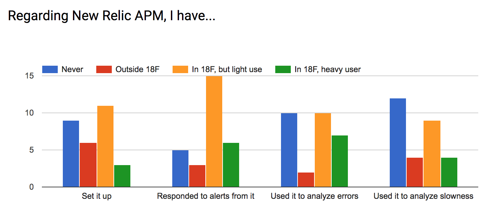
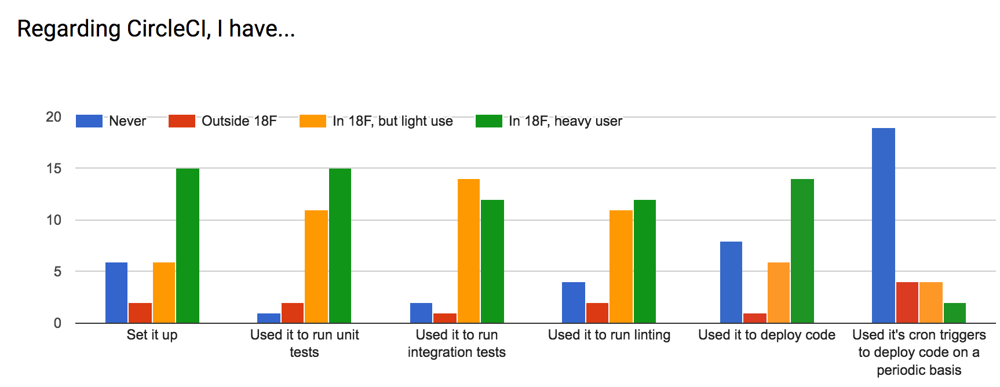

As we've begun to [define](/integrations/) a standard set of third-party
services we use in our apps, we wanted to measure existing familiarity. This
will help us determine where we should focus documentation and training
efforts. We had 29 responses from a pool of roughly 65.

[See full
data](https://docs.google.com/spreadsheets/d/1VELGLG9yL6QG-iggEqYofDOLW5qa6S-62yFuHcqS5ls/edit?usp=sharing)

## New Relic

Hypothetically, New Relics is the backbone of our app monitoring. Its
"Synthetics" service provides uptime alerts and the "APM" service tracks app
performance, including exceptions, slow queries, etc. The responses indicate
a significant chunk of our devs aren't using APM to its potential and that
very few projects are using Synthetics. Training on both topics is critical,
though the priority should probably be placed on Synthetics due to cost vs.
benefit.

CM and Adam will find an engineer to spearhead these training efforts.

## Continuous Integration

We've standardized on CircleCI as our platform for running tests, linting, and
deploying code. We have a good grasp of how to use the tool for testing and
linting, and are largely comfortable with deploying code from CI. We don't use
its cron triggers to redeploy daily, a (current) requirement of many ATOs.
This may not be a concern in the future, however, as cloud.gov begins running
its own scanning.

## Dependency Analysis

We don't write the majority of the code we run; instead, we rely on
well-vetted, open source libraries for many core functions. While this reduces
the number of bugs we introduce and speeds up our development, we _are_
responsible for ensuring those dependencies are up to date, particularly
around security issues. Previously, we had standardized on Gemnasium to alert
us of security updates, but that service is shutting down in May '18; we're
actively moving a replacement through the approval process now.

Unfortunately, the majority of our developers are not familiar with these
tools. The Gemnasium transition will offer a good opportunity for training
everyone on the new system.

DKP will push for more consistent dependency analysis processes across
projects.

## User Analytics

Federal websites are generally required to integrate GSA's [Digital Analytics
Program](https://www.digitalgov.gov/services/dap/), which uses Google
Analytics as its back end. The majority of our developers have _some_
experience with Google Analytics, but aren't using it extensively. Further,
few have set up DAP.

Jeremia will work with the front end guild to figure why projects aren't
integrating DAP or using the provided analytics. Relatedly, he will push on
performance metrics tracking.

## Cloud.gov

Cloud.gov is our default Platform-as-a-Service, capable of hosting relatively
complex architectures. It has an advanced log viewer (Kibana), integration
with S3, can generate SSL certificates (via [Let's
Encrypt](https://letsencrypt.org/)), and much more.

The data's a bit mixed here, but our devs appear to have a good grasp of basic
usage. We see some drop off around slightly more complex architectures and
less common use cases (e.g. worker apps, one-off tasks). Regarding services,
there's a bimodal distribution between folks who are comfortable with Kibana
and those who aren't. Surprisingly, very few devs are (intentionally) using
the CDN service (which handles SSL certs). This may be an artifact of a poorly
worded question.

## Other Services

In our last multi-choice poll question, we asked about a few niche services
and our coverage tracking service, Code Climate. Though most projects don't
need these services, when relevant, our devs are using Federalist and
api.data.gov. To a lesser extent, DigitalGov search has been selected for use,
which may indicate less familiarity.

Most engineers are using Code Climate for general code quality metrics, but
fewer are using its test coverage tracking features. The tool is often
mentioned in our ATO docs, which may be boosting the former.

## Open Ended

Finally, we gave respondents a relatively open-ended prompt: "Other thoughts?
Do these tools meet your needs?". Summarizing these responses:

* Reviewing cloud.gov logs is difficult; similarly, there's some unfamiliarity
  with DAP
* We'd like to use more free services, including cross-browser testing. Some
  teams are using CodeCov for coverage tracking
* Code Climate be noisy with false positives
* Training is key; we incorrectly assume devs can intuit all of these tools
* We should have a baseline configuration for each tool
* Some projects have a dedicated infrastructure person
